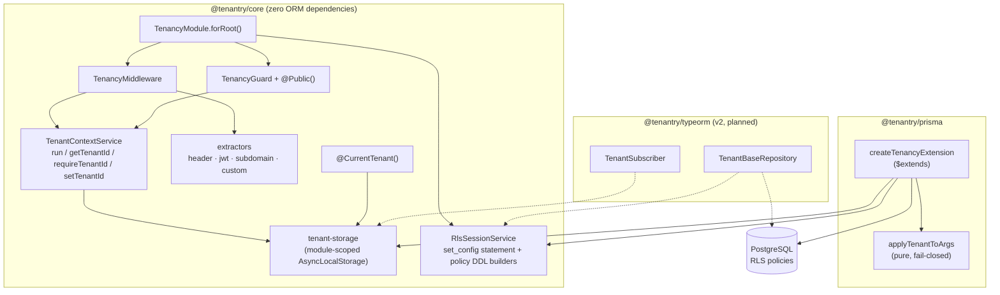
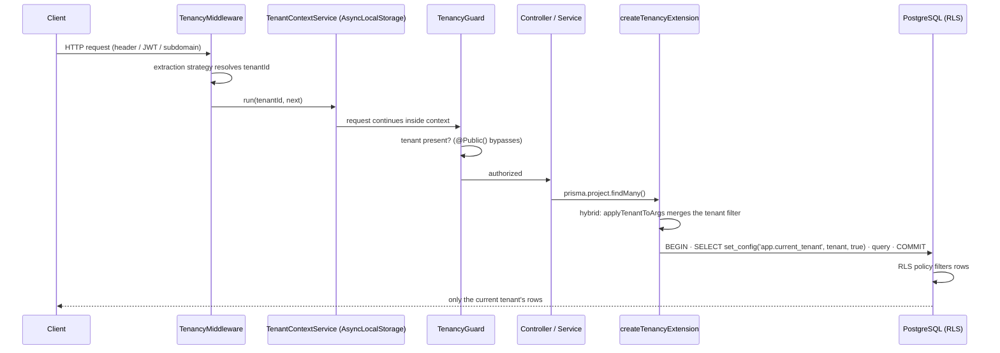

# Architecture

## Overview

Tenantry is built around one non-negotiable rule: **the core never depends on an ORM**. Everything tenant-related that is ORM-agnostic — context propagation, extraction, guards, RLS session management — lives in `@tenantry/core`. Each ORM gets a thin adapter package that plugs into that core.

## Package/component diagram

## Request flow (v1, Prisma)

## Key decisions

### AsyncLocalStorage over request-scoped providers

NestJS request-scoped providers force re-instantiation of the whole dependency subtree per request — measurable overhead and viral scope creep. `AsyncLocalStorage` propagates the tenant through the async call chain with near-zero cost and works outside HTTP too (queues, cron), as long as the caller wraps the unit of work in `TenantContextService.run()`. The storage is module-scoped so `@CurrentTenant()` and the Prisma extension can read it without DI access.

One consequence users must know: Prisma promises are lazy, so the `await` must happen **inside** the context (`run(tenant, async () => prisma...)`).

### RLS as defense in depth, not an afterthought

Application-level filtering (`where tenantId = ?`) is one forgotten `where` away from a data leak. PostgreSQL Row-Level Security enforces isolation _in the database_: with the session variable bound and a policy on each tenant-aware table, even buggy application code cannot read another tenant's rows. Tenantry supports:

- **hybrid** (default): application filter + RLS — belt and suspenders;
- **rls-only**: no application filter, the policy is the single source of truth.

Both modes are covered by integration tests against a real PostgreSQL (Testcontainers), including a test that _deliberately introduces an application bug_ — an unfiltered raw query — and proves RLS still holds.

### `set_config(..., true)` in a batch transaction, not `SET LOCAL`

Three constraints led here: the tenant id must be a **bind parameter** (never SQL text — `SET` doesn't accept parameters, `set_config()` does); the binding must live on the **same pooled connection** as the query (hence the batch transaction wrapping both); and it must **die with the transaction** (`is_local = true`) so a pooled connection can never leak a binding into the next request.

### Fail closed, everywhere

A missing tenant throws (`MissingTenantError`); an unknown Prisma operation throws (`UnsupportedOperationError`) rather than running unfiltered; an unbound session variable makes policies evaluate to false (empty table, not full table); invalid identifiers for DDL throw (`UnsafeSqlValueError`). For an isolation library, a loud failure is always cheaper than a silent leak.

### Superusers and table owners

PostgreSQL superusers bypass RLS unconditionally; table owners bypass it unless the table is `FORCE`d. Tenantry's DDL builders always emit `FORCE ROW LEVEL SECURITY`, the docs and the example app model the two-role pattern (admin for migrations, restricted `app_user` for the app), and the integration suite connects as a non-superuser — because testing through a superuser would prove nothing.

### Changesets over semantic-release

Releases are human-triggered: changesets accumulate on `main`, and a release PR is merged deliberately. No surprise publishes.

### Monorepo layout

| Path                  | Role                                                        |
| --------------------- | ----------------------------------------------------------- |
| `packages/core`       | `@tenantry/core` — ORM-agnostic, zero ORM dependencies      |
| `packages/prisma`     | `@tenantry/prisma` — Prisma Client extension (v1)           |
| `apps/example-prisma` | Runnable NestJS demo (REST API + docker-compose PostgreSQL) |
| `apps/docs`           | VitePress site → GitHub Pages                               |
