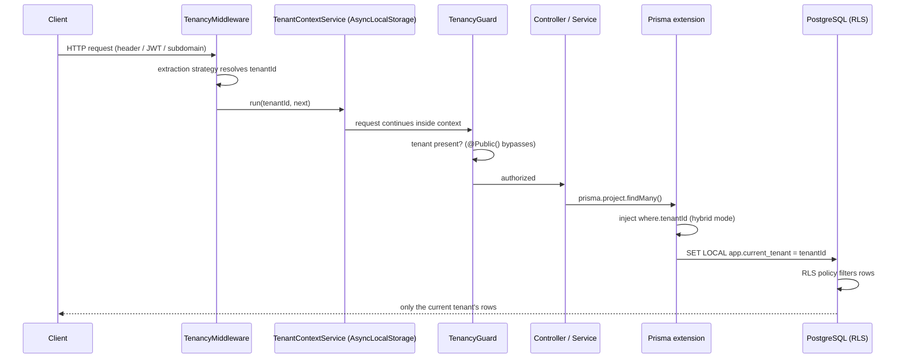

# Architecture

## Overview

Tenantry is built around one non-negotiable rule: **the core never depends on an ORM**. Everything tenant-related that is ORM-agnostic — context propagation, extraction, guards, RLS session management — lives in `@tenantry/core`. Each ORM gets a thin adapter package that plugs into that core.

```
@tenantry/core          ← AsyncLocalStorage context, strategies, guard, decorators, RLS session
    ↑            ↑
@tenantry/prisma   @tenantry/typeorm (v2)
```

## Request flow (v1, Prisma)



## Key decisions

### AsyncLocalStorage over request-scoped providers

NestJS request-scoped providers force re-instantiation of the whole dependency subtree per request — measurable overhead and viral scope creep. `AsyncLocalStorage` propagates the tenant through the async call chain with near-zero cost and works outside HTTP too (queues, cron), as long as the caller wraps the unit of work in `TenantContextService.run()`.

### RLS as defense in depth, not an afterthought

Application-level filtering (`where tenantId = ?`) is one forgotten `where` away from a data leak. PostgreSQL Row-Level Security enforces isolation _in the database_: with `SET app.current_tenant` bound to the connection/transaction and a policy on each tenant-aware table, even buggy application code cannot read another tenant's rows. Tenantry supports:

- **hybrid** (default): application filter + RLS — belt and suspenders;
- **rls-only**: no application filter, the policy is the single source of truth.

Both modes are covered by integration tests against a real PostgreSQL (Testcontainers), including a test that _deliberately introduces an application bug_ and proves RLS still holds.

### `SET LOCAL` inside transactions

Session variables are set with `SET LOCAL` inside a transaction so the tenant binding can never leak across pooled connections.

### Changesets over semantic-release

Releases are human-triggered: changesets accumulate on `main`, and a release PR is merged deliberately. No surprise publishes.

### Monorepo layout

| Path                  | Role                                                        |
| --------------------- | ----------------------------------------------------------- |
| `packages/core`       | `@tenantry/core` — ORM-agnostic, zero ORM dependencies      |
| `packages/prisma`     | `@tenantry/prisma` — Prisma Client extension (v1)           |
| `apps/example-prisma` | Runnable NestJS demo (REST API + docker-compose PostgreSQL) |
| `apps/docs`           | VitePress site → GitHub Pages                               |
